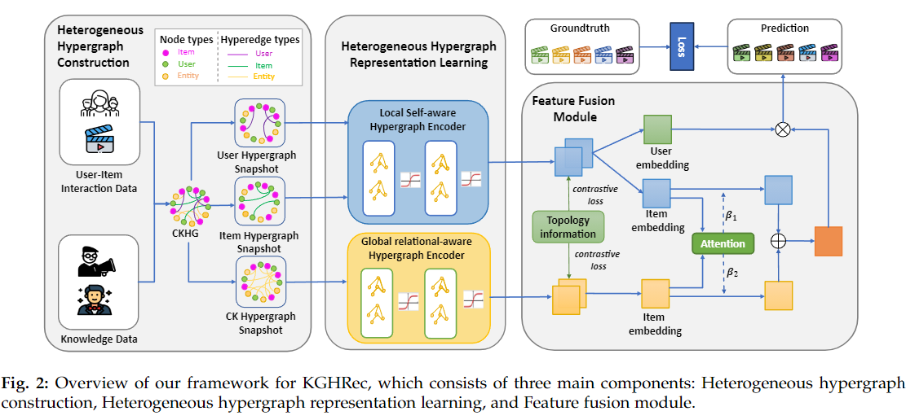
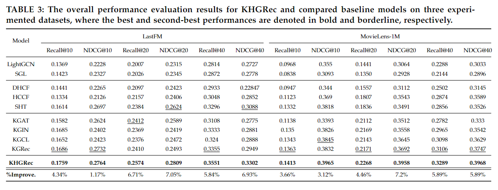

# Overview
This is the official code of our proposal method Knowledge-guided collaborative filtering recommendation with Heterogeneous
Hypergraph Attention (KHGRec) with PyTorch implementation

# Abstract
The rapid progress of industrial development, urbanization, and traffic have caused air quality degradation that negatively affects human health and environmental sustainability, especially in developed countries. However, due to the limited number of sensors available, the air quality index at many locations is not monitored. Therefore, many research, including statistical and machine learning approaches, have been proposed to tackle the problem of estimating air quality value at an arbitrary location. Most of the existing research perform interpolation process based on traditional techniques that leverage distance information. In this work, we propose a novel deep-learning-based model for air quality value estimation. This approach follows the encoder-decoder paradigm, with the encoder and decoder trained separately using different training mechanisms. In the encoder component, we proposed a new self-supervised graph representation learning approach for spatio-temporal data. For the decoder component, we designed a deep interpolation layer that employs two attention mechanisms and a fully-connected layer using air quality data at known stations, distance information, and meteorology information at the target point to predict air quality at arbitrary locations. The experimental results show that our proposed model increases the estimation accuracy from 4.93\% to 34.88\% in MAE metrics compared to the state-of-the-art approaches



##  Install package
```
pip install -r requirements.txt
```
## Data
Download data from [link](https://drive.google.com/file/d/1JoNoc_EDzV2EOH1vFhYcgMjOQgu-MSMz/view?usp=sharing)

Download this file, then decompress this file and locate it at the path like that /path-to-repo/dataset.

This file contains data from ML-1M and LastFM dataset

## Pretrained weight 
Download the pretrained weight from [link]()

## Training 
To train the model from scratch with the default setting
```
python main.py --model=HGNN --dataset=lastfm  --lrate=0.0001 --weight_decay=5e-6 --drop_rate=0.2 --p=0.3 --cl_rate=1e-05 --temp=0.2 --reg=0.1 --early_stopping_steps=50
```

## Parameters 
* ```--model``` Selected model name.
* ```--gpu_id``` Id of GPU.
* ```--dataset``` Dataset name.
* ```--alpha``` KG Loss regularizer hyperparameters.
* ```--lrate``` Selected learning rate.
* ```--item_ranking``` Top items to evaluate.
* ```--item_ranking``` Top items to evaluate.
* ```--max_epoch``` Maximum epoch to run.
* ```--batch_size``` Selected batch size.
* ```--hyperedge_num``` Number of hyperedges.
* ```--batch_size_kg``` Selected knowledge batch size.
* ```--n_layers``` Number of model's layers.
* ```--embedding_size``` Embedding size.
* ```--input_dim``` Input dimension.
* ```--relation_dim``` Relational embedding dimension.
* ```--hyper_dim``` Hypergraph embedding dimension.
* ```--lr_decay``` Learning rate decay.
* ```--weight_decay``` Weight decay.
* ```--reg``` Lambda when calculating KG l2 loss.
* ```--reg_kg``` Lambda when calculating CF l2 loss.
* ```--p``` Leaky.
* ```--drop_rate``` Drop rate.
* ```--nheads``` Num of heads.
* ```--temp``` Temperature term.
* ```--cl_rate``` Contrastive rate.